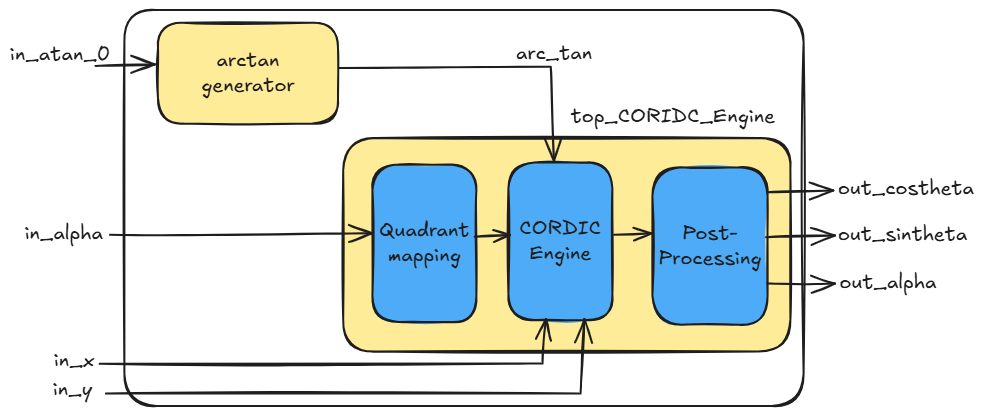
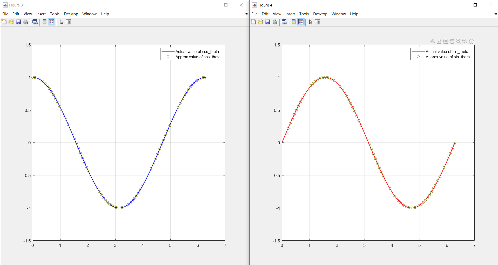

<!---

This file is used to generate your project datasheet. Please fill in the information below and delete any unused
sections.

You can also include images in this folder and reference them in the markdown. Each image must be less than
512 kb in size, and the combined size of all images must be less than 1 MB.
-->

## How it works
Cordic-16 is a ROM Less cordic implementation with 16 bit signed fixed point input-Q3.16  (1 sign bit 3 integer bits and 12 fraction bits). This core comprises of (i) a single stage CORDIC Engine that operates in rotation mode for computing $cos$ and $sin$ of input angle $\theta$, and (ii) an $arctan$ generator that generates the micro-rotation angles dynamically in each clock cycle for the corresponding iteration.

  

<em>Figure 1: Block Diagarm of the ROM-less CORDIC Engine</em>

   
The aformentioned CORDIC core accepts the input angle $\theta$ in radian format, since $\theta \in [0, 2\pi]$, 3-bits are sufficient to accomodate integer part of the angle and 12 bits for fractional part to achieve accuracy. Hence 16-bit data width is chosen and CORDIC engine is iterated over 13 iterations. In this implementation, the micro-rotation angles $arctan$ were generated using Taylor series approximation to avoid the memory for storing them.

### Basic Functionality of CORDIC CORE

The CORDIC core computes trigonometric functions by rotating a vector iteratively by breaking down the angle of rotation into a set of small pre-defined angles. If a two-dimensional vector $v_0=[x_0,y_0]$ is rotated by an angle $\theta$ then it results a vector $v_L=[x_L,y_L]$. The rotation angle $\theta$ is expressed as a series of $L$ micro-rotation angles $\alpha_i = \arctan(2^{-i})$ as shown below.

$$\theta = \sum_{i=0}^{L-1}\sigma_i\alpha_i, ~i=0,1,2,\cdots L-1$$
	
where, $\sigma_i=\pm1$ controls the direction of the micro-rotation. In each iteration, the vector is rotated with elementary angle $\alpha_i$ as follows, 

$$x_{i+1} = x_i-\sigma_i2^{-i}y_i$$

$$y_{i+1} = y_i+\sigma_i2^{-i}x_i$$

$$z_{i+1} = z_i-\sigma_i\alpha_i$$

where $z_i$ corresponds to the rotation angle in $i^{th}$ iteration and $z_0$ is the initial angle. In, rotation mode, $\sigma_i = \text{sign}(z_i)$. The basic architecture for the implementation of CORDIC core can be found in the references given at the end of this documentation.

Note that, the CORDIC core performs rotation only in Quadrant 1 and 4 (Q1 & Q4) i.e., $\theta \in [-pi/4 , pi/4]$. If input angle lies in Q2 or Q3 then it should be mapped into either Q1/Q4 and post-process the CORDIC output as follows,

|  Quadrant  | $cos(\theta)$        |   $sin(\theta)$    |
|------------|--------------        | -------------------|
|     Q1     | cos_output_CORDIC    | sin_output_CORDIC  |
|     Q2     | -sin_output_CORDIC   | cos_output_CORDIC  |
|     Q3     | -cos_output_CORDIC   | -sin_output_CORDIC | 
|     Q4     | sin_output_CORDIC    | -cos_output_CORDIC |

As said, micro-rotation angles were genearted using Taylor's series approximation, it is found that the mean absolute error between actual and computed value is found to be $0.003$ for $1000$ samples. This was evaluated using MATLAB, below figure shows the approximation of computed value over the actual results.

  

<em>Figure 2: Comparision of actual and computed value</em>

## How to test

The cordic is interfaced using SPI and one byte is transferred at a time, the core expects 8 bytes (64 bit input) as {in_atan_0,in_aplha,in_x,in_y} where in, each of the input has data width of 16-bit. After Receiving these inputs, the engine generates the output as {out_alpha, out_costheta, out_sintheta} wherein each of them is 16 bit. Thus we receive total of 6 bytesfrom SPI.

Here 

|  Signal name           | Details      |
|------------------------|------------  |
|     in_y               | scaled y_cordinate of input vector (0 in case of calculation of sin and cos)|
|     in_x               | scaled x_cordinate of input vector          |
|     in_alpha           | input angle in radian            |
|     in_atan_0          | initial micro-rotation angle             |
|     out_sintheta       | output $cos(\theta)$ value             |
|     out_costheta       | output $sin(\theta)$ value             |
|     out_alpha          | output converged value of input angle (0 in case of sin and cos calculation)             |

## External hardware

Externally a SPI master is required to communicate and send the input data to the CORDIC.

We have used RP2040 (Pico) for all our testing.

### Reference 

A lot more about cordic can be understood from this paper 
 * [50 Years of CORDIC : Algorithms, Architectures, and Applications](https://ieeexplore.ieee.org/document/5089431)
